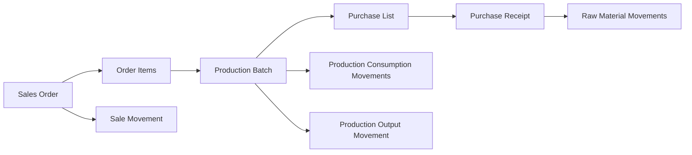
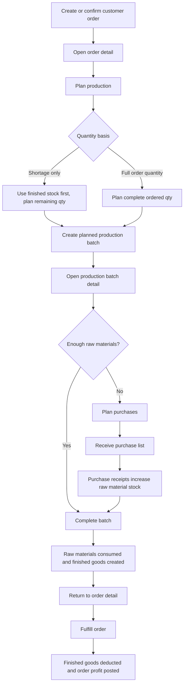
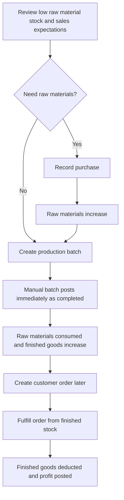
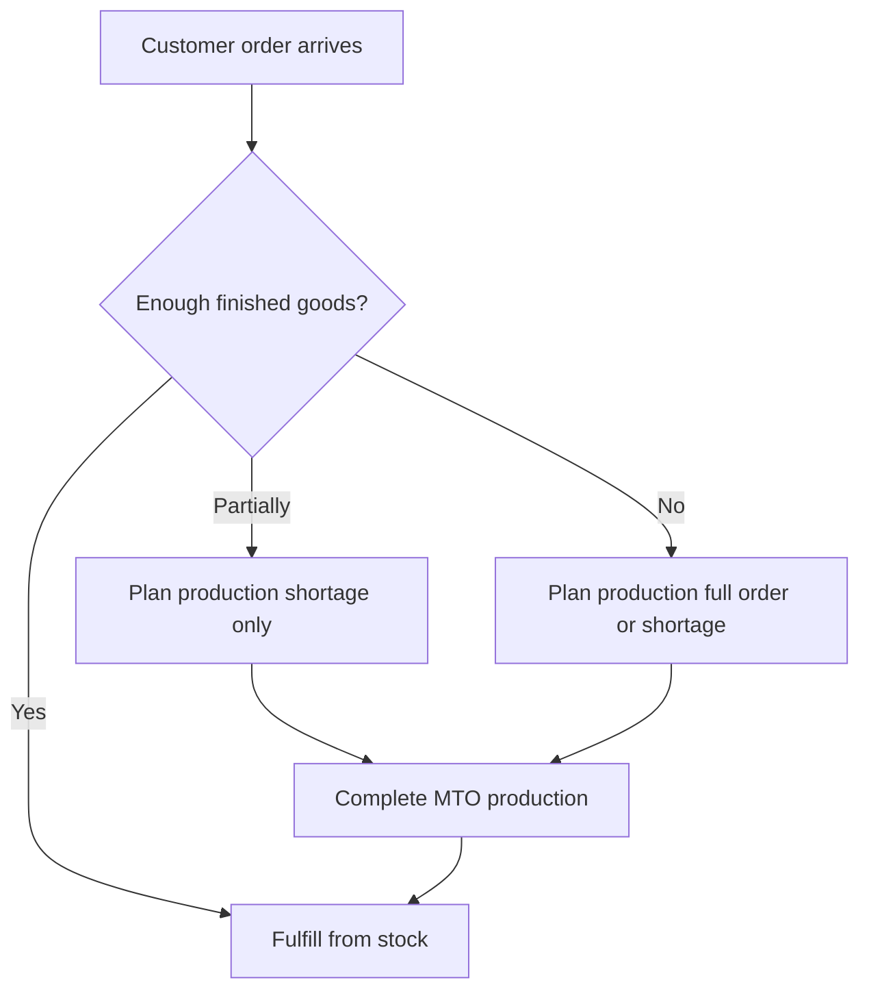

# Puffy Petals Workflow Guide

This guide explains the two operating models supported by the app:

- **MTO, Make to Order:** customer demand starts production and purchasing.
- **MTS, Make to Stock:** production creates finished-goods stock before customer orders arrive.

The app uses one traceability backbone for both models: purchases, production batches, order fulfillment, and stock adjustments all create immutable inventory movements when they change stock.

## Core Concepts

| Concept | Meaning | Stock impact |
| --- | --- | --- |
| Material variant | A purchasable and stock-tracked raw material, such as 12mm pearls or gold wire. | None by itself |
| Product | A finished flower product with price, labor, overhead, packaging, and BOM. | None by itself |
| BOM | Recipe lines for a product. Each line has material, quantity, and waste percentage. | None by itself |
| Purchase list | A non-stock-changing purchasing plan generated from a production batch shortage. | None |
| Purchase receipt | The actual record of materials received. | Increases raw material stock |
| Planned batch | A planned production batch linked to an order. | None |
| Completed batch | A posted production batch. | Consumes raw materials and increases finished goods |
| Fulfilled order | A posted customer shipment/sale. | Decreases finished goods |

## Traceability Chain

Use traceability to answer:

- Which order caused this batch?
- Which materials were planned for this batch?
- Which purchases replenished those materials?
- Which stock movements posted to inventory?
- Which finished goods were consumed by fulfillment?

## MTO Workflow

MTO starts from a customer order. Production and purchase planning are created only for demand that needs making.

### Step 1: Prepare Master Data

Before using MTO, set up:

1. Suppliers in **Suppliers**.
2. Materials and variants in **Materials**.
3. Product BOMs in **Products**.
4. Optional product pictures through `product.photo_url` or the local placeholder fallback.

Good setup rules:

- Every BOM line should use the correct material variant.
- Every material should have a preferred supplier when possible.
- Material target/min stock should reflect normal operating buffers.
- Product labor, packaging, overhead, and target margin should be maintained before quoting.

### Step 2: Create The Sales Order

Go to **Orders → Add order**.

Recommended MTO status:

- Use `confirmed` once the order should drive production.
- Use `draft` for inquiries or unconfirmed orders.

Order creation reserves finished goods when the order is confirmed, but it does not deduct stock. Deduction happens only when the order is fulfilled.

### Step 3: Plan Production From The Order

Open the order detail page and click **Plan production**.

Choose the quantity basis:

- **Shortage only:** recommended for most MTO work. Existing finished goods cover part of the order; planned batches only cover the remaining shortage.
- **Full order quantity:** useful when the whole order must be made fresh, even if stock exists.

The app:

- Aggregates repeated product lines.
- Subtracts already open planned/in-progress batches linked to the same order.
- Creates one planned production batch per product.
- Links each planned batch back to the order/order items.
- Moves eligible orders to `in_production`.

Important: planned batches do not consume materials and do not add finished goods.

### Step 4: Plan Purchases From The Batch

Open the production batch detail page and click **Plan purchases**.

The app:

- Reads the product BOM.
- Multiplies BOM quantity and waste by batch quantity.
- Compares required quantity to current raw-material stock.
- Creates purchase-list lines only for shortages.
- Groups lines by preferred supplier when possible.

Important: purchase lists are planning documents only. They do not change stock.

### Step 5: Receive The Purchase List

Go to either:

- **Production → Batch detail → Purchase Lists → Receive**
- **Purchases → Purchase Lists → Receive**

The receive dialog is the realization step for the purchase plan.

Review and adjust:

- Supplier per line.
- Purchase quantity.
- Quantity added to stock.
- Actual total price.
- Receipt date and purchase link.

When saved, the app:

- Creates purchase receipt records.
- Creates one receipt per supplier group if lines use different suppliers.
- Links the receipt back to the purchase list.
- Marks the purchase list as received.
- Increases raw material stock.
- Updates latest material cost.
- Writes purchase inventory movements and material price history.

### Step 6: Complete Production

Return to the production batch detail page and click **Complete batch**.

The app:

- Checks raw material availability unless negative stock is enabled.
- Consumes BOM materials.
- Adds finished goods.
- Captures unit and total manufacturing cost.
- Marks the batch as completed.
- Writes immutable production consumption and production output movements.

### Step 7: Fulfill The Order

Return to the order detail page and click **Fulfill order**.

The app:

- Deducts finished goods.
- Updates order COGS, revenue, gross profit, net profit, and margin.
- Marks fulfillment as fulfilled.
- Prevents double deduction with `stock_deducted`.
- Writes sale inventory movements.

## MTS Workflow

MTS starts from an internal decision to build finished-goods stock before orders arrive.

### Step 1: Stock Materials

Use **Purchases → Record purchase** when buying materials for general stock.

This directly:

- Increases raw material stock.
- Updates latest cost.
- Writes purchase movements.
- Adds material price history.

### Step 2: Produce Finished Goods

Use **Production → Create batch**.

Current manual MTS batch behavior:

- The batch is created as completed immediately.
- Raw materials are consumed immediately.
- Finished goods are added immediately.
- Inventory movements are posted immediately.

Use this path when production is not tied to a customer order.

### Step 3: Sell From Stock

Create an order in **Orders → Add order**, then fulfill it from available finished goods.

No production planning is required unless stock is insufficient or you decide to replenish using an MTO-style planned batch.

## Hybrid Workflow

Some real workflows mix MTS and MTO.

Recommended hybrid default:

- Use **shortage only** for most orders.
- Use **full order quantity** when quality, freshness, customization, or batch consistency matters.

## Operating Controls

### Stock-changing steps

Only these actions change stock:

- **Record purchase**
- **Receive purchase list**
- **Complete batch**
- **Fulfill order**
- **Manual stock adjustment**

### Non-stock-changing steps

These actions only plan or define data:

- Add/update supplier.
- Add/update material.
- Add/update product/BOM.
- Create order.
- Plan production.
- Plan purchases.

### Suggested daily routine

1. Review new orders.
2. Plan production for confirmed MTO orders.
3. Review production batches and create purchase lists for shortages.
4. Buy materials externally.
5. Receive purchase lists when materials arrive.
6. Complete production batches.
7. Fulfill orders.
8. Check dashboard and low-stock materials.

## Status Meanings

### Order status

| Status | Use |
| --- | --- |
| `draft` | Order not ready for production or fulfillment. |
| `confirmed` | Valid demand; can plan production. |
| `in_production` | Planned production exists for this order. |
| `ready_to_pack` | Optional operational status before fulfillment. |
| `packed` | Fulfillment posted or package prepared. |
| `shipped` | Shipment sent. |
| `completed` | Order fully closed. |
| `cancelled` | Demand cancelled. |
| `returned` | Return flow applies. |

### Production batch status

| Status | Use |
| --- | --- |
| `planned` | Work is planned, no stock posted. |
| `in_progress` | Work has started, no final stock posting yet. |
| `completed` | Materials consumed and finished goods posted. |
| `cancelled` | Planned work should not be completed. |

### Purchase list status

| Status | Use |
| --- | --- |
| `draft` | Planned shortage list, not yet received. |
| `ordered` | Reserved for a future supplier-order state. |
| `received` | Converted into purchase receipt records. |
| `cancelled` | Plan should no longer be used. |

## Common Scenarios

### An order needs more finished goods than available

1. Open order detail.
2. Click **Plan production**.
3. Choose **Shortage only**.
4. Open the planned batch.
5. Plan purchases if needed.
6. Receive purchase list when materials arrive.
7. Complete batch.
8. Fulfill order.

### You want to make stock for a weekend sale

1. Record raw material purchases if needed.
2. Use **Production → Create batch**.
3. Verify finished-goods stock increased.
4. Create and fulfill orders as sales happen.

### Purchase list has lines from multiple suppliers

1. Click **Receive** on the purchase list.
2. Review supplier per line.
3. Save once.
4. The app creates separate purchase receipts by supplier group.

### Actual purchase quantity or price differs from plan

1. Click **Receive**.
2. Adjust purchase quantity, stock-added quantity, and total price.
3. Save the receipt.
4. The actual receipt becomes the financial and inventory record; the purchase list remains the planning source.

## Audit Rules

- Do not edit inventory movements directly.
- Correct mistakes with a reversing movement or stock adjustment.
- Treat purchase lists and planned batches as planning records.
- Treat purchase receipts, completed batches, and fulfilled orders as posted operational records.
